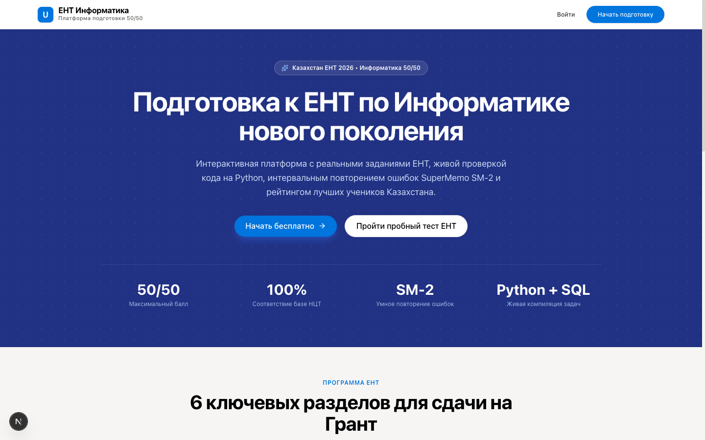
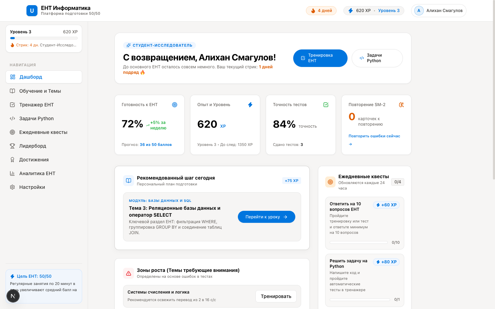
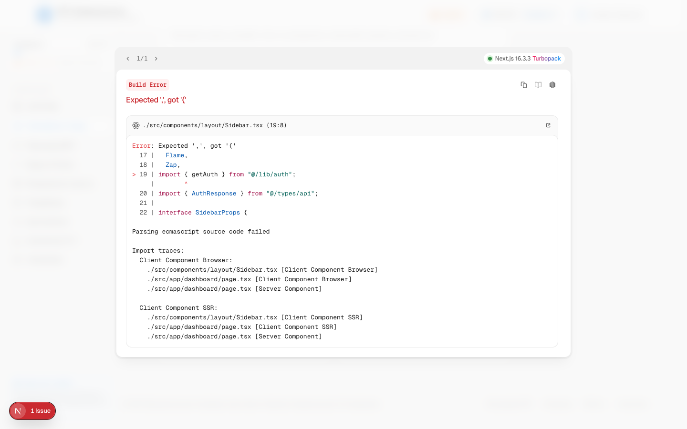
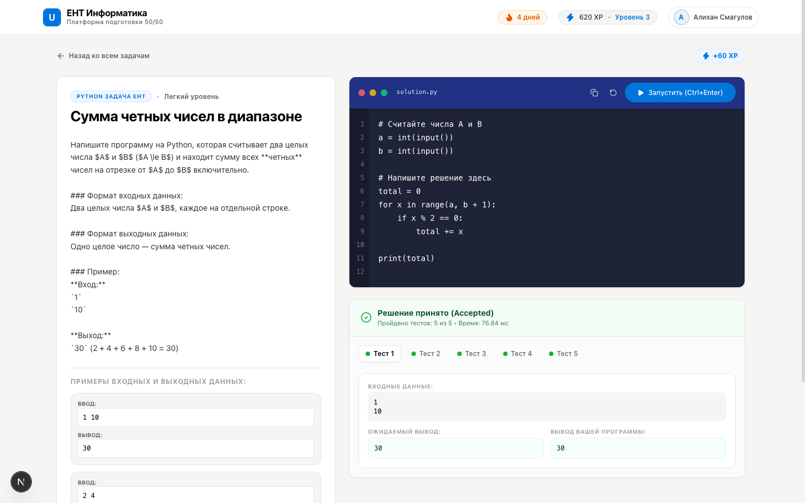
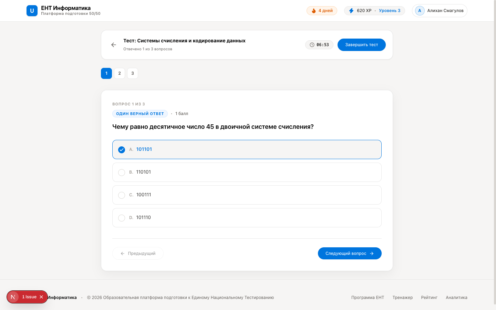
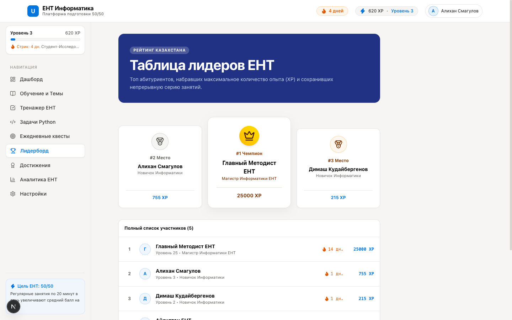
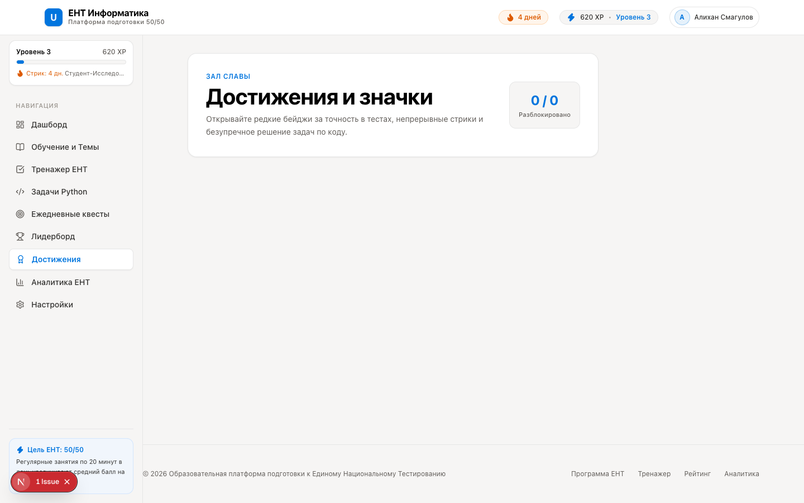
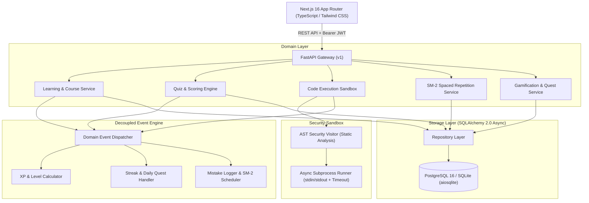

<div align="center">

# UNTverse

**Gamified UNT Informatics preparation for the next generation of students.**

[](https://github.com/mrnamazbek/untverse/actions/workflows/ci.yml)
[](https://fastapi.tiangolo.com)
[](https://nextjs.org)
[](https://www.typescriptlang.org)
[](https://python.org)
[](https://www.postgresql.org)
[](LICENSE)

<br />

<p align="center">
  
</p>

</div>

---

## 📖 Overview

**UNTverse** is an educational platform engineered for Kazakhstan students preparing for the **Unified National Testing (UNT / ҰБТ) in Informatics**. 

Rather than relying on static PDF test collections, UNTverse turns test preparation into an engaging, structured, and feedback-rich learning journey:
- **Full NCT Kazakhstan Curriculum**: 6 core domains covering Number Systems & Logic, Python Algorithms, Relational Databases & SQL, Computer Networks, Cybersecurity, and Data Structures.
- **In-Browser Python Execution Sandbox**: Safe, AST-inspected sub-process runner with automated test cases and execution benchmarks.
- **Adaptive Spaced Repetition (SuperMemo SM-2)**: Automated mistake tracking that resurfaces hard concepts at mathematically optimal intervals (1, 6, 14 days).
- **Gamification Engine**: Daily quests, XP rewards, leveling progression, streak preservation, unlockable achievements, and national leaderboards.
- **Notion-Inspired Design**: Clean, distraction-free aesthetic matching the [DESIGN-notion.md](DESIGN-notion.md) design specification (`#f6f5f4` paper canvas, `#213183` night band, `#0075de` Notion blue CTA).

---

## 📸 Screenshots

| Student Dashboard | Topic Roadmap & Modules |
| :---: | :---: |
|  |  |
| *Readiness gauge, daily quests, weak areas* | *Structured curriculum matching NCT standards* |

| Live Python IDE & Test Runner | Interactive Quiz Engine |
| :---: | :---: |
|  |  |
| *Subprocess sandbox with live test validation* | *Live timer, question navigator, and review* |

| National Leaderboard | Achievements & Badges |
| :---: | :---: |
|  |  |
| *Top-ranked students across Kazakhstan* | *Unlockable milestones and streak rewards* |

---

## 🏗️ Architecture

The backend adheres to Clean Layered Architecture (`API` $\rightarrow$ `Services` $\rightarrow$ `Events` $\rightarrow$ `Repositories` $\rightarrow$ `Models`), fully decoupling business domain logic from storage and presentation.



Detailed architectural decisions are documented as Architecture Decision Records in [`docs/adr/`](docs/adr/):
- **[ADR-001: Authentication Strategy](docs/adr/ADR-001-authentication-strategy.md)** — JWT access tokens, database-backed rotating refresh tokens, RBAC.
- **[ADR-002: Backend Modular Architecture](docs/adr/ADR-002-backend-modular-architecture.md)** — Layered separation of concerns and dependency injection.
- **[ADR-003: Database Schema and Indexing](docs/adr/ADR-003-database-schema-and-indexing.md)** — 18 relational entities, foreign key cascades, and composite B-tree indexes.
- **[ADR-004: Event-Driven Gamification Engine](docs/adr/ADR-004-event-driven-gamification-engine.md)** — Decoupled event dispatcher for XP, level progression, and streaks.
- **[ADR-005: Code Execution Sandbox Abstraction](docs/adr/ADR-005-code-execution-sandbox-abstraction.md)** — AST-level security validation and process isolation.
- **[System Overview](docs/architecture_overview.md)** — Topology and cross-cutting concerns.

---

## ⚡ Tech Stack

| Layer | Technology | Purpose |
| :--- | :--- | :--- |
| **Frontend** | [Next.js 16](https://nextjs.org) (App Router) | Server-rendered & client-optimized web application |
| | [React 19](https://react.dev) & [TypeScript](https://www.typescriptlang.org) | Component model and strict static typing |
| | [Tailwind CSS v4](https://tailwindcss.com) | Design system tokens and responsive utility styling |
| | [Lucide React](https://lucide.dev) & [Canvas Confetti](https://www.npmjs.com/package/canvas-confetti) | Visual icons and celebratory animations |
| **Backend** | [FastAPI](https://fastapi.tiangolo.com) | High-performance asynchronous REST API |
| | [Python 3.11](https://python.org) | Core language runtime |
| | [SQLAlchemy 2.0 Async](https://www.sqlalchemy.org) | Asynchronous ORM and relational query builder |
| | [Pydantic v2](https://docs.pydantic.dev) | Schema validation and settings management |
| | [Alembic](https://alembic.sqlalchemy.org) | Database schema migrations |
| **Database** | [PostgreSQL 16](https://www.postgresql.org) | Production relational database with composite indexes |
| | [aiosqlite](https://github.com/omnilib/aiosqlite) | Zero-setup asynchronous SQLite driver for local dev & testing |
| **Sandbox** | Python AST Analyzer | Static analysis blocking forbidden modules (`os`, `sys`, `eval`, etc.) |
| | Async Subprocess Runner | Isolated test execution with memory and execution timeouts |
| **DevOps** | [Docker](https://www.docker.com) & Docker Compose | Multi-stage container builds and complete stack orchestration |
| | [GitHub Actions](https://github.com/features/actions) | Continuous Integration pipeline (pytest, lint, build checks) |
| | [Railway](https://railway.app) & [Vercel](https://vercel.com) | Cloud deployment targets for backend and frontend |

---

## ✨ Features & Status

| Feature | Status | Description |
| :--- | :---: | :--- |
| **Authentication & RBAC** | ✅ Available | JWT access + rotating refresh tokens in DB, student/teacher/admin roles |
| **Multilingual i18n Routing** | ✅ Available | Strict segment-based `/kk`, `/ru`, `/en` with Next.js 16 `proxy.ts` parameter preservation |
| **UNT 2026 Knowledge Base** | ✅ Available | 6 core sections, 24 taxonomy topics, IT grant score cutoffs (115-138) and schedules |
| **Verified Question Bank** | ✅ Available | Questions with official NTC provenance, difficulty levels (A/B/C) and step-by-step solutions |
| **Daily Ingestion & News** | ✅ Available | Automated 06:00 & 18:00 news aggregator with SHA-256 deduplication and HTML sanitization |
| **SSE & JSONL Streaming** | ✅ Available | Real-time SSE progress/events and high-throughput NDJSON bulk question export |
| **Curriculum Roadmap** | ✅ Available | 6 comprehensive UNT topic modules with theoretical lessons and notes |
| **Interactive Quiz Engine** | ✅ Available | Timed quizzes, single/multiple choice, SQL queries, instant answer review |
| **Python Code Sandbox** | ✅ Available | In-browser IDE, AST security blocking, execution against test cases |
| **SuperMemo SM-2 Repetition** | ✅ Available | Spaced repetition flashcards for questions missed in previous tests |
| **Gamification Core** | ✅ Available | XP engine, levels ($\text{Lvl} = 1 + \sqrt{\text{XP}/150}$), streaks, rank titles |
| **Daily Quests** | ✅ Available | Daily auto-resetting missions with claimable XP rewards |
| **Achievements & Badges** | ✅ Available | Milestones for score thresholds, streaks, and coding challenges |
| **National Leaderboard** | ✅ Available | Top-ranked students sorted by total XP and streak performance |
| **Readiness Analytics** | ✅ Available | Predicted UNT score (out of 50), category mastery bars, mistake logs |
| **Admin Management Portal** | ✅ Available | Teacher analytics dashboard, dynamic topic & source ingestion management |

---

## 📁 Repository Structure

```text
untverse/
├── backend/                  # FastAPI Application
│   ├── alembic/              # Database migration scripts
│   ├── app/
│   │   ├── api/v1/           # Versioned REST & streaming endpoints
│   │   │   └── endpoints/    # Auth, Users, News, Questions, UNT, Stream, etc.
│   │   ├── core/             # Configuration, security, exceptions, events
│   │   ├── db/               # Session management, Base model, seed script
│   │   ├── models/           # SQLAlchemy 2.0 entities (23 tables)
│   │   ├── repositories/     # Database access layer
│   │   ├── schemas/          # Pydantic v2 validation models
│   │   └── services/         # Domain logic (News, Ingestion, QuestionBank, SM-2)
│   ├── tests/                # 19 Pytest unit and integration tests (74% coverage)
│   ├── Dockerfile            # Multi-stage Python 3.11 runner
│   └── requirements.txt      # Backend dependencies
├── frontend/                 # Next.js 16 Web Application
│   ├── src/
│   │   ├── app/              # Next.js App Router
│   │   │   ├── [locale]/     # Localized routes (kk/ru/en for 16+ pages)
│   │   │   ├── layout.tsx    # Root HTML layout
│   │   │   └── page.tsx      # Root locale redirect
│   │   ├── components/       # UI components (Layout, Quiz, Coding IDE, Gamification)
│   │   ├── lib/              # API client, i18n dictionaries, Auth session
│   │   ├── proxy.ts          # Next.js 16 proxy for i18n & request intercept
│   │   └── types/            # TypeScript domain interfaces
│   ├── Dockerfile            # Multi-stage Node.js 20 Alpine runner
│   └── package.json          # Frontend dependencies
├── docs/                     # Technical Documentation
│   ├── adr/                  # Architecture Decision Records (ADR-001 to ADR-005)
│   ├── images/               # Verified UI screenshots
│   └── architecture_overview.md
├── .github/                  # CI workflows (Green on push/PR) & daily scheduler
├── docker-compose.yml        # Multi-container local orchestration
└── README.md                 # Project documentation
```

---

## 🚀 Local Development

### Prerequisites
- **Python 3.11+**
- **Node.js 20+** and `npm`
- **Git**

### 1. Clone the Repository
```bash
git clone git@github.com:mrnamazbek/untverse.git
cd untverse
```

### 2. Backend Setup
```bash
cd backend

# Create virtual environment
python3 -m venv venv
source venv/bin/activate  # On Windows: venv\Scripts\activate

# Install dependencies
pip install -r requirements.txt

# Run initial migrations and start server (auto-creates SQLite DB & seeds curriculum)
uvicorn app.main:app --host 127.0.0.1 --port 8000 --reload
```
*API documentation (Swagger UI) is available at: `http://127.0.0.1:8000/docs`*

### 3. Frontend Setup
```bash
# In a new terminal window
cd frontend

# Install dependencies
npm install

# Start development server
npm run dev
```
*Web application is available at: `http://localhost:3000`*

### 4. Running via Docker Compose (Recommended for Full Stack)
```bash
# From repository root
docker compose up --build
```

---

## 🧪 Testing

### Backend Test Suite
Run the automated `pytest` suite covering authentication, code execution sandbox security, gamification, and quiz scoring:
```bash
cd backend
PYTHONPATH=. pytest tests/ -v --cov=app
```

### Frontend Build & Type Check
Verify TypeScript compilation and Next.js static route generation:
```bash
cd frontend
npm run build
```

---

## ⚙️ Environment Variables

Copy `.env.example` to `.env` to configure deployment settings:

| Variable | Default | Description |
| :--- | :--- | :--- |
| `ENVIRONMENT` | `development` | Runtime environment (`development` / `production`) |
| `PORT` | `8000` | Backend API port |
| `DATABASE_URL` | `sqlite+aiosqlite:///./unt_informatics.db` | PostgreSQL (`postgresql+asyncpg://...`) or SQLite URL |
| `JWT_SECRET` | *(required in prod)* | Secret key for signing HMAC-SHA256 JWT tokens |
| `ACCESS_TOKEN_EXPIRE_MINUTES` | `30` | Access token lifespan |
| `REFRESH_TOKEN_EXPIRE_DAYS` | `30` | Refresh token expiration in database |
| `CORS_ORIGINS` | `["http://localhost:3000"]` | Allowed frontend origin URLs |
| `NEXT_PUBLIC_API_URL` | `http://localhost:8000/api/v1` | API base URL for frontend fetch client |

---

## 🚢 Deployment

### Railway (Backend & PostgreSQL)
1. Link the repository to [Railway](https://railway.app).
2. Provision a **PostgreSQL** database service.
3. Deploy the `backend/` directory using the provided [`railway.json`](railway.json) configuration.
4. Set environment variables (`DATABASE_URL`, `JWT_SECRET`, `ENVIRONMENT=production`, `CORS_ORIGINS`).

### Vercel (Frontend)
1. Import the `frontend/` folder in [Vercel](https://vercel.com).
2. Framework Preset: **Next.js**.
3. Set environment variable: `NEXT_PUBLIC_API_URL=https://your-backend.railway.app/api/v1`.
4. Deploy using the included [`frontend/vercel.json`](frontend/vercel.json).

---

## 🗺️ Roadmap

- [x] **Phase 1: Foundation (v1.0)** — Domain models, JWT auth with refresh tokens, NCT-aligned seed data, Notion-style UI.
- [x] **Phase 2: Interactive Engines (v1.0)** — Python AST sandbox runner, quiz scoring engine, SuperMemo SM-2 adapter.
- [x] **Phase 3: Gamification & Analytics (v1.0)** — XP system, streaks, daily quests, achievements, student command center.
- [ ] **Phase 4: Advanced Simulator (v1.1)** — Full 50-question mock exam generator with national percentile benchmarks.
- [ ] **Phase 5: AI Exam Tutor (v2.0)** — Contextual Socratic hints for coding tasks and tricky logical questions.
- [ ] **Phase 6: Mobile Experience (v2.1)** — Progressive Web App (PWA) offline flashcards and Telegram mini-app integration.

---

## 🤝 Contributing

Contributions are welcome! Please read [CONTRIBUTING.md](CONTRIBUTING.md) for details on our code of conduct, development workflow, and pull request process.

---

## 🔒 Security

For security vulnerabilities and responsible disclosure, please refer to [SECURITY.md](SECURITY.md).

---

## 📄 License

This project is open-source and licensed under the [MIT License](LICENSE).
