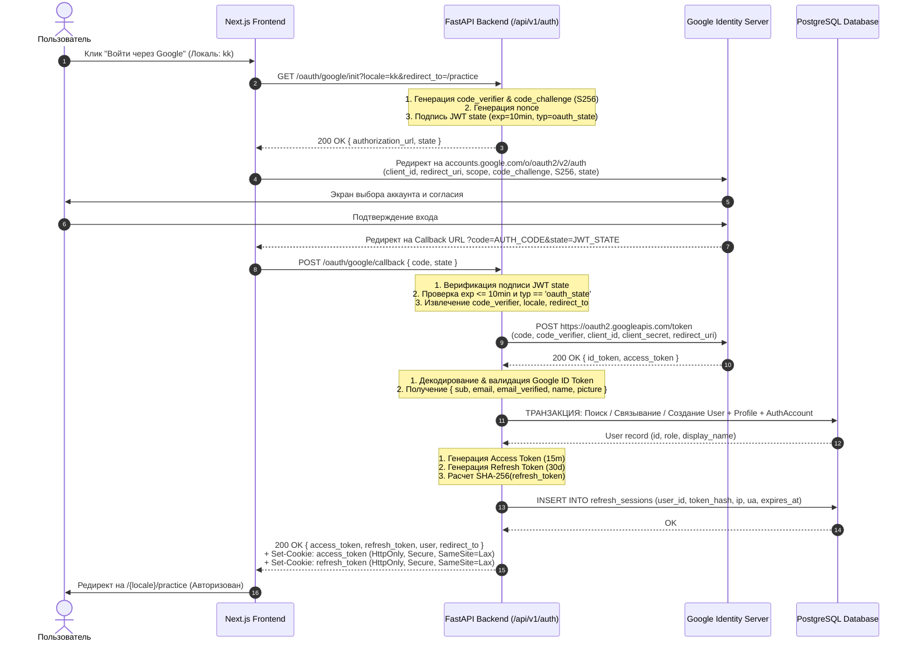
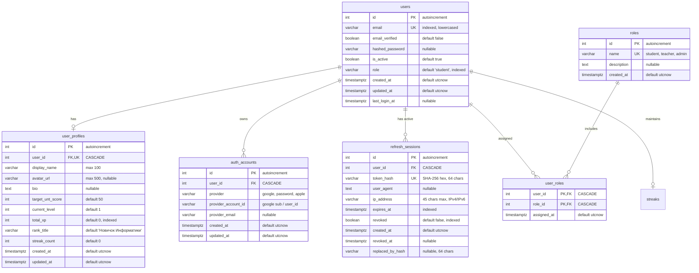
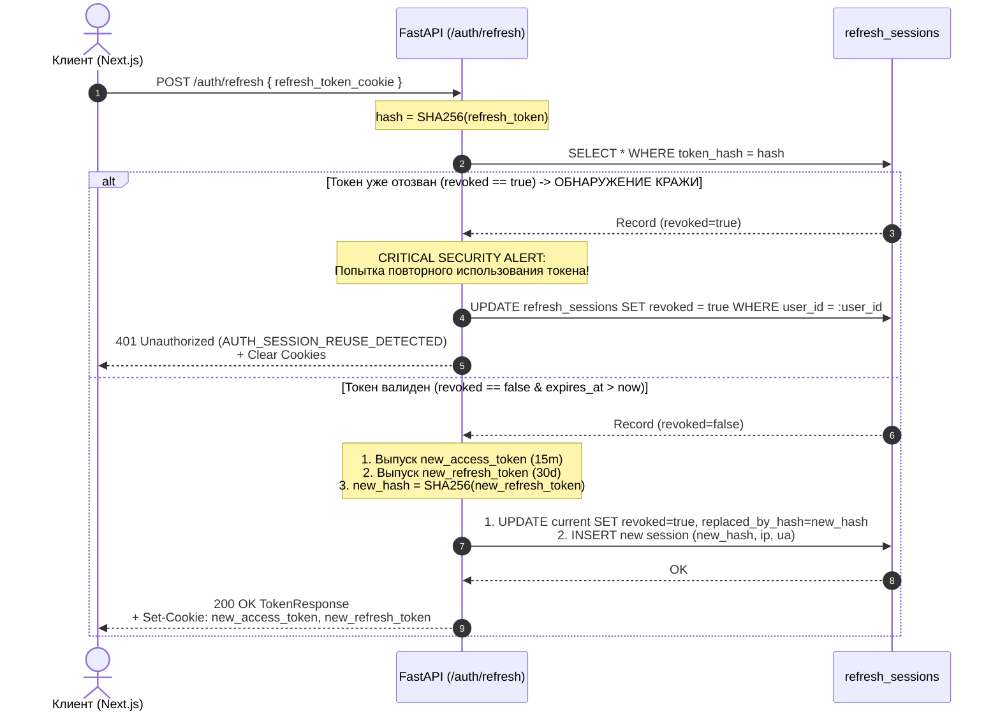

# ADR-006: Унифицированная система аутентификации и Google OAuth 2.0 с PKCE

## Статус
Принято (Accepted) — Расширяет и актуализирует [ADR-001](file:///Users/namazbekbekzhanov/AntigravityProjects/informatics_site/docs/adr/ADR-001-authentication-strategy.md) для продакшн-контура UNTverse.

## Контекст
Платформа UNTverse требует безопасной, масштабируемой и отказоустойчивой системы аутентификации, поддерживающей:
1. **Google OAuth 2.0 Authorization Code Flow с PKCE (RFC 7636)** — для удобного входа учащихся в один клик без паролей.
2. **Многопровайдерность и безопасный Account Linking** — прозрачное связывание аккаунтов (Google, локальный логин по паролю, будущие Apple ID/Яндекс/Telegram).
3. **Строгую защиту токенов и сессий** — короткоживущие Access JWT (15 минут), ротацию Refresh-токенов (30 дней) с хранением исключительно SHA-256 хешей в БД и автоматическим обнаружением кражи/повторного использования токенов (Token Reuse / Replay Detection).
4. **Stateless State Verification** — криптографически подписанный JWT `state` (HS256) со встроенным `code_verifier`, `locale`, `redirect_to`, `nonce` и TTL 10 минут, устраняющий потребность в серверном Redis/сессионном хранилище на этапе OAuth-редиректов.
5. **Мультиязычную локализацию ошибок** (`kk`, `ru`, `en`) и кросс-платформенную совместимость (Web Next.js с HttpOnly/Secure/SameSite=Lax куками + Bearer Headers для API/Mobile).

---

## Архитектура решения

### 1. Архитектурная диаграмма аутентификации (C4 Container View)

```mermaid
flowchart TD
    subgraph Client ["Клиентский уровень (Web Next.js / Mobile)"]
        Browser["Браузер пользователя"]
        AppRouter["Next.js App Router (kk / ru / en)"]
    end

    subgraph IdentityProvider ["Identity Provider"]
        GoogleAuth["Google Identity Server\n(accounts.google.com)"]
        GoogleTokenAPI["Google Token & UserInfo API\n(oauth2.googleapis.com)"]
    end

    subgraph BackendGateway ["UNTverse Backend (FastAPI)"]
        AuthRouter["Auth Router (/api/v1/auth)"]
        AuthService["AuthService & PKCE Manager"]
        SecCore["Security Core (JWT HS256, SHA-256 Hasher)"]
    end

    subgraph Storage ["База данных (PostgreSQL / aiosqlite)"]
        DB_Users[("users")]
        DB_Accounts[("auth_accounts")]
        DB_Sessions[("refresh_sessions")]
        DB_Roles[("roles & user_roles")]
        DB_Profiles[("user_profiles")]
    end

    Browser -->|1. Нажатие 'Войти через Google'| AppRouter
    AppRouter -->|2. GET /auth/oauth/google/init?locale=kk&redirect_to=/dashboard| AuthRouter
    AuthRouter -->|3. Генерация PKCE (S256) + Подпись JWT state| SecCore
    AuthRouter -->|4. Редирект на Google Authorization URL| GoogleAuth
    GoogleAuth -->|5. Согласие пользователя и редирект с code + state| Browser
    Browser -->|6. Callback с ?code=...&state=...| AuthRouter
    AuthRouter -->|7. Валидация JWT state, извлечение code_verifier| SecCore
    AuthRouter -->|8. POST /token (code + code_verifier)| GoogleTokenAPI
    GoogleTokenAPI -->|9. Возврат id_token & profile| AuthRouter
    AuthRouter -->|10. Атомарный Account Linking / Provisioning| DB_Users
    AuthRouter --> DB_Accounts
    AuthRouter --> DB_Profiles
    AuthRouter -->|11. Сохранение SHA-256(refresh_token)| DB_Sessions
    AuthRouter -->|12. Установка HttpOnly Cookies + Возврат DTO| Browser
```

---

## 2. Спецификация Google OAuth 2.0 с PKCE (RFC 7636) и Signed JWT State

### 2.1. Криптографические параметры PKCE (RFC 7636)
- **`code_verifier`**:
  - Высокоэнтропийная криптографически стойкая случайная строка, генерируемая через `secrets.token_urlsafe(64)`.
  - Длина: 86 символов (в диапазоне стандарта RFC 7636 от 43 до 128 символов).
  - Алфавит: `[A-Za-z0-9\-_.~]`.
  - Энтропия: $\ge 256$ бит.
- **`code_challenge`**:
  - Метод трансформации: **`S256`** (`code_challenge_method = "S256"`). Использование `plain` строго запрещено.
  - Формула:
    $$\text{code\_challenge} = \text{BASE64URL\_WITHOUT\_PADDING}(\text{SHA256}(\text{ASCII}(\text{code\_verifier})))$$
  - Python-реализация:
    ```python
    import hashlib
    import base64
    import secrets

    def generate_pkce_pair() -> tuple[str, str]:
        code_verifier = secrets.token_urlsafe(64)
        digest = hashlib.sha256(code_verifier.encode("ascii")).digest()
        code_challenge = base64.urlsafe_b64encode(digest).decode("ascii").rstrip("=")
        return code_verifier, code_challenge
    ```

### 2.2. Спецификация Signed JWT `state`
Вместо хранения промежуточного состояния авторизации в серверном Redis/сессиях (что создает проблемы масштабирования и зависимости от кэша), параметр `state` формируется как компактный криптографически подписанный токен (JWT HS256).

#### Полезная нагрузка (Payload Claims) `state`:
| Клейм | Тип | Описание | Пример |
|---|---|---|---|
| `cv` | `string` | PKCE `code_verifier` в формате URL-safe | `"vR7k...9mA"` |
| `loc` | `string` | Выбранный язык интерфейса пользователя (`"kk" \| "ru" \| "en"`) | `"kk"` |
| `rd` | `string` | Санитизированный относительный путь редиректа после успешного входа | `"/dashboard"` |
| `nonce` | `string` | Случайный UUIDv4/hex для защиты от CSRF и replay-атак | `"b3c8f1a0-4d3e-4b2a..."` |
| `iat` | `integer` | Время выпуска (Unix Timestamp в секундах) | `1756300000` |
| `exp` | `integer` | Время истечения (TTL ровно 10 минут) | `1756300600` |
| `typ` | `string` | Тип токена, строго `"oauth_state"` | `"oauth_state"` |
| `iss` | `string` | Издатель токена (`"untverse.kz"`) | `"untverse.kz"` |

#### Защита от Open Redirect:
Параметр `redirect_to` проходит строгую серверную валидацию:
1. Должен начинаться с одиночного слеша `/` и не должен начинаться с `//` (защита от протокол-относительных ссылок `//evil.com`).
2. Допускаются только относительные пути, соответствующие регулярному выражению: `^\/(?!\/)[a-zA-Z0-9_\-\/\.\?=&%#]*$`.
3. Любой невалидный URL принудительно сбрасывается на `/dashboard`.

---

## 3. Детальная последовательность Authorization Code Flow (Sequence Diagram)



---

## 4. Нормализованная схема данных (ER Diagram & DDL)



### 4.1. Спецификация таблиц и индексов

#### Таблица `users`:
- `id`: `INTEGER PRIMARY KEY GENERATED ALWAYS AS IDENTITY` (в PostgreSQL) или `Integer autoincrement` (в SQLite).
- `email`: `VARCHAR(255) NOT NULL UNIQUE` (индекс B-tree). Всегда сохраняется в `lower()`.
- `email_verified`: `BOOLEAN NOT NULL DEFAULT FALSE`. Выставляется в `TRUE` автоматически при входе через проверенный Google-аккаунт (`email_verified=true`) или при подтверждении почты по ссылке.
- `hashed_password`: `VARCHAR(255) NULL` — опциональный пароль. Пользователи, зарегистрированные исключительно через Google OAuth, имеют `NULL`.
- `is_active`: `BOOLEAN NOT NULL DEFAULT TRUE`. При `FALSE` вход и обновление сессий блокируются.
- `role`: `VARCHAR(50) NOT NULL DEFAULT 'student'` (индекс `idx_users_role`). Служит быстрым single-source of truth для JWT-токенов без лишних JOIN.
- `created_at`: `TIMESTAMP WITH TIME ZONE NOT NULL DEFAULT (now() AT TIME ZONE 'utc')`.
- `updated_at`: `TIMESTAMP WITH TIME ZONE NOT NULL DEFAULT (now() AT TIME ZONE 'utc')`.
- `last_login_at`: `TIMESTAMP WITH TIME ZONE NULL`.

#### Таблица `auth_accounts`:
- `id`: `INTEGER PRIMARY KEY GENERATED ALWAYS AS IDENTITY`.
- `user_id`: `INTEGER NOT NULL REFERENCES users(id) ON DELETE CASCADE`.
- `provider`: `VARCHAR(50) NOT NULL` (допустимые значения: `'google'`, `'password'`, `'apple'`, `'github'`).
- `provider_account_id`: `VARCHAR(255) NOT NULL` (для Google — строковый `sub`, например `"109823746192837465012"`).
- `provider_email`: `VARCHAR(255) NULL`.
- `created_at`: `TIMESTAMP WITH TIME ZONE NOT NULL DEFAULT (now() AT TIME ZONE 'utc')`.
- `updated_at`: `TIMESTAMP WITH TIME ZONE NOT NULL DEFAULT (now() AT TIME ZONE 'utc')`.
- **Ограничения**:
  - `CONSTRAINT uq_auth_accounts_provider_account UNIQUE (provider, provider_account_id)`
  - `INDEX idx_auth_accounts_user_id (user_id)`
  - `INDEX idx_auth_accounts_user_provider (user_id, provider)`

#### Таблица `refresh_sessions`:
- `id`: `INTEGER PRIMARY KEY GENERATED ALWAYS AS IDENTITY`.
- `user_id`: `INTEGER NOT NULL REFERENCES users(id) ON DELETE CASCADE`.
- `token_hash`: `VARCHAR(64) NOT NULL UNIQUE` — строго SHA-256 hex digest токена (raw-токен никогда не пишется в БД!).
- `user_agent`: `TEXT NULL`.
- `ip_address`: `VARCHAR(45) NULL` (поддержка IPv4 и IPv6).
- `expires_at`: `TIMESTAMP WITH TIME ZONE NOT NULL` (индекс `idx_refresh_sessions_expires_at`).
- `revoked`: `BOOLEAN NOT NULL DEFAULT FALSE` (индекс `idx_refresh_sessions_revoked`).
- `created_at`: `TIMESTAMP WITH TIME ZONE NOT NULL DEFAULT (now() AT TIME ZONE 'utc')`.
- `revoked_at`: `TIMESTAMP WITH TIME ZONE NULL`.
- `replaced_by_hash`: `VARCHAR(64) NULL` — ссылка на хеш нового токена при ротации (для отслеживания цепочки и обнаружения атак повторного использования).
- **Индексы**:
  - `INDEX idx_refresh_sessions_lookup (token_hash, revoked, expires_at)`
  - `INDEX idx_refresh_sessions_user_active (user_id, revoked)`

#### Таблицы `roles` и `user_roles`:
- `roles`: `id (PK), name VARCHAR(50) UNIQUE ('student', 'teacher', 'admin', 'moderator'), description TEXT, created_at TIMESTAMPTZ`.
- `user_roles`: `user_id INT REFERENCES users(id) ON DELETE CASCADE, role_id INT REFERENCES roles(id) ON DELETE CASCADE, assigned_at TIMESTAMPTZ, PRIMARY KEY (user_id, role_id)`.

---

## 5. Матрица и правила Account Linking (Привязка аккаунтов)

### 5.1. Правила безопасности привязки
1. **Авторитетность поставщика (IdP Authority)**:
   - Google считается доверенным IdP при условии флага `email_verified == true` в Google ID Token.
2. **Защита от захвата аккаунта (Pre-Hijacking Protection / RFC 6749 BCP)**:
   - Если Google возвращает `email_verified == false`, автоматическое связывание с существующим пользователем **КАТЕГОРИЧЕСКИ ЗАПРЕЩЕНО**. Возвращается ошибка `AUTH_OAUTH_EMAIL_UNVERIFIED`.
3. **Безопасное связывание (Safe Linking)**:
   - Если пользователь уже существует в базе `users` по `email`, и Google подтверждает `email_verified == true`:
     - Создается запись в `auth_accounts` с `provider='google'` и `provider_account_id=google_sub`.
     - `users.email_verified` переводится в `TRUE`.
     - `users.last_login_at` обновляется на текущее время.
     - Если профиль не содержит аватара, а Google предоставил `picture`, обновляется `user_profiles.avatar_url`.
     - Пароль `users.hashed_password` **НЕ** затирается. Пользователь сохраняет возможность входа как по паролю, так и через Google.
4. **Атомарная инициализация нового пользователя (Atomic Provisioning)**:
   - Если пользователя с таким `email` нет:
     - В рамках единой транзакции БД создаются:
       1. Запись в `users` (`email_verified=True`, `hashed_password=None`).
       2. Запись в `user_profiles` (с именем из Google или префиксом email, аватаром, базовым рангом "Новичок Информатики").
       3. Запись в `auth_accounts` (`provider='google'`).
       4. Стартовая запись в `streaks` (`current_streak=0`, `max_streak=0`).
       5. Сессия в `refresh_sessions` с SHA-256 хешем сгенерированного refresh-токена.
5. **Вход по паролю для чисто Google-аккаунтов**:
   - При попытке входа через `/api/v1/auth/login` с `hashed_password IS NULL` возвращается ошибка `AUTH_PASSWORD_NOT_SET`.
6. **Правило неотзываемости единственного метода**:
   - Пользователь не может отвязать Google-аккаунт, если у него не задан пароль (`hashed_password IS NULL`) и нет других привязанных провайдеров.

```mermaid
flowchart TD
    Start([Google Callback: Получены данные профиля]) --> CheckVerif{Google email_verified == true?}
    CheckVerif -- Нет --> ErrUnverified[Ошибка: AUTH_OAUTH_EMAIL_UNVERIFIED<br/>Запрет связывания]
    CheckVerif -- Да --> FindAccount{Есть auth_accounts(google, sub)?}

    FindAccount -- Да --> UpdateLogin[Обновить last_login_at<br/>Выпустить сессию]
    FindAccount -- Нет --> FindUser{Есть users(email)?}

    FindUser -- Да (Существующий) --> LinkAccount[БЕЗОПАСНЫЙ ACCOUNT LINKING:<br/>1. INSERT auth_accounts(google, sub)<br/>2. users.email_verified = TRUE<br/>3. Синхронизация аватара при отсутствии<br/>4. Выпустить сессию]
    FindUser -- Нет (Новый) --> ProvisionNew[АТОМАРНАЯ ИНИЦИАЛИЗАЦИЯ:<br/>1. INSERT users(email, hashed_pwd=NULL)<br/>2. INSERT user_profiles(name, avatar)<br/>3. INSERT auth_accounts(google, sub)<br/>4. INSERT streaks<br/>5. Выпустить сессию]

    UpdateLogin --> IssueTokens[Генерация Access (15m) + Refresh (30d)<br/>Хеширование SHA-256 -> refresh_sessions]
    LinkAccount --> IssueTokens
    ProvisionNew --> IssueTokens
    IssueTokens --> Finish([Установка HttpOnly Cookies + Редирект])
```

---

## 6. Жизненный цикл токенов, сессий и Cookie-стратегия

### 6.1. Access Token (JWT HS256)
- **Алгоритм**: `HS256` (HMAC-SHA256) с использованием `JWT_SECRET`.
- **Время жизни (TTL)**: **15 минут** (`ACCESS_TOKEN_EXPIRE_MINUTES = 15`).
- **Структура полезной нагрузки (Claims)**:
  ```json
  {
    "sub": "104",
    "email": "student@untverse.kz",
    "role": "student",
    "type": "access",
    "jti": "8b5e9f7a-8123-4456-789a-bcdef0123456",
    "iat": 1756300000,
    "exp": 1756300900,
    "iss": "untverse.kz"
  }
  ```

### 6.2. Refresh Token (JWT HS256) и сессии в БД
- **Алгоритм**: `HS256`.
- **Время жизни (TTL)**: **30 дней** (`REFRESH_TOKEN_EXPIRE_DAYS = 30`).
- **Структура полезной нагрузки (Claims)**:
  ```json
  {
    "sub": "104",
    "type": "refresh",
    "jti": "e4a2b1c0-9876-5432-10fe-dcba98765432",
    "iat": 1756300000,
    "exp": 1758892000,
    "iss": "untverse.kz"
  }
  ```
- **Хранение в БД**:
  - Строковый raw-токен выдается **только** клиенту.
  - В БД сохраняется **исключительно**:
    $$\text{token\_hash} = \text{hashlib.sha256}(\text{raw\_refresh\_token.encode('utf-8')}).\text{hexdigest()}$$
  - В случае компрометации дампа базы злоумышленник не получает действующих токенов сессий.

### 6.3. Алгоритм ротации токенов и защита от компрометации (Token Reuse / Replay Detection)
При каждом вызове `/api/v1/auth/refresh`:
1. Вычисляется `current_hash = sha256(incoming_refresh_token).hexdigest()`.
2. Запрашивается запись в `refresh_sessions WHERE token_hash = current_hash`.
3. **Случай А: Токен не найден** $\rightarrow$ `401 Unauthorized (AUTH_SESSION_NOT_FOUND)`.
4. **Случай Б: Токен найден, но `revoked == TRUE` (Обнаружение кражи/повторного использования!)**:
   - Данная ситуация означает, что скомпрометированный старый токен был отправлен повторно.
   - **Протокол безопасности**:
     1. Немедленный отзыв всех активных сессий пользователя:
        `UPDATE refresh_sessions SET revoked = TRUE, revoked_at = NOW() WHERE user_id = :user_id`
     2. Логирование инцидента безопасности с IP и User-Agent.
     3. Очистка кук клиента.
     4. Возврат ошибки `401 Unauthorized (AUTH_SESSION_REUSE_DETECTED)`.
5. **Случай В: Токен найден, активен (`revoked == FALSE`) и не истек**:
   - Генерируется новая пара Access Token + Refresh Token.
   - Старая сессия инвалидируется:
     `UPDATE refresh_sessions SET revoked = TRUE, revoked_at = NOW(), replaced_by_hash = :new_token_hash WHERE id = :session_id`
   - Создается новая сессия с `new_token_hash`, актуальным IP и User-Agent.
   - Новые токены передаются клиенту.



### 6.4. Cookie-стратегия

| Атрибут Cookie | Значение для `access_token` | Значение для `refresh_token` | Обоснование |
|---|---|---|---|
| **HttpOnly** | `True` | `True` | Защита от кражи через XSS в JS-коде |
| **Secure** | `True` (prod) / `False` (local dev) | `True` (prod) / `False` (local dev) | Передача только по HTTPS шифрованному каналу |
| **SameSite** | `Lax` | `Lax` | Защита от CSRF, корректная передача при OAuth-редиректах с Google |
| **Path** | `/` | `/api/v1/auth` (или `/`) | Минимизация передачи refresh токена на каждый запрос статики |
| **Max-Age** | `900` секунд (15 мин) | `2592000` секунд (30 дней) | Соответствует TTL токена |
| **Domain** | `.untverse.kz` (prod) / `None` (dev) | `.untverse.kz` (prod) / `None` (dev) | Доступность для поддоменов API и Web-приложения |

---

## 7. Контракты DTO / Схем

### 7.1. Python (Pydantic v2) Контракты

```python
# app/schemas/auth.py
from datetime import datetime
from enum import Enum
from typing import Optional, Dict, Any, List
from pydantic import BaseModel, EmailStr, Field, ConfigDict, HttpUrl


class SupportedLocale(str, Enum):
    KK = "kk"
    RU = "ru"
    EN = "en"


class AuthProvider(str, Enum):
    GOOGLE = "google"
    PASSWORD = "password"
    APPLE = "apple"
    GITHUB = "github"


class AuthErrorCode(str, Enum):
    AUTH_INVALID_CREDENTIALS = "AUTH_INVALID_CREDENTIALS"
    AUTH_USER_NOT_FOUND = "AUTH_USER_NOT_FOUND"
    AUTH_USER_INACTIVE = "AUTH_USER_INACTIVE"
    AUTH_PASSWORD_NOT_SET = "AUTH_PASSWORD_NOT_SET"
    AUTH_EMAIL_ALREADY_EXISTS = "AUTH_EMAIL_ALREADY_EXISTS"
    AUTH_OAUTH_INIT_FAILED = "AUTH_OAUTH_INIT_FAILED"
    AUTH_OAUTH_STATE_INVALID = "AUTH_OAUTH_STATE_INVALID"
    AUTH_OAUTH_STATE_EXPIRED = "AUTH_OAUTH_STATE_EXPIRED"
    AUTH_OAUTH_CODE_EXCHANGE_FAILED = "AUTH_OAUTH_CODE_EXCHANGE_FAILED"
    AUTH_OAUTH_EMAIL_UNVERIFIED = "AUTH_OAUTH_EMAIL_UNVERIFIED"
    AUTH_SESSION_EXPIRED = "AUTH_SESSION_EXPIRED"
    AUTH_SESSION_REVOKED = "AUTH_SESSION_REVOKED"
    AUTH_SESSION_REUSE_DETECTED = "AUTH_SESSION_REUSE_DETECTED"
    AUTH_UNAUTHORIZED = "AUTH_UNAUTHORIZED"
    AUTH_FORBIDDEN = "AUTH_FORBIDDEN"
    AUTH_INVALID_REDIRECT_URI = "AUTH_INVALID_REDIRECT_URI"
    AUTH_CANNOT_UNLINK_LAST_PROVIDER = "AUTH_CANNOT_UNLINK_LAST_PROVIDER"


class OAuthInitResponse(BaseModel):
    authorization_url: str = Field(..., description="Google OAuth 2.0 URL с параметрами PKCE и state")
    state: str = Field(..., description="Криптографически подписанный JWT state")


class OAuthCallbackRequest(BaseModel):
    code: str = Field(..., description="Authorization code, полученный от Google")
    state: str = Field(..., description="Подписанный JWT state для верификации и распаковки PKCE verifier")


class UserProfileResponse(BaseModel):
    id: int
    user_id: int
    display_name: str
    avatar_url: Optional[str] = None
    bio: Optional[str] = None
    target_unt_score: int
    current_level: int
    total_xp: int
    rank_title: str
    streak_count: int
    created_at: datetime
    updated_at: Optional[datetime] = None

    model_config = ConfigDict(from_attributes=True)


class AuthAccountResponse(BaseModel):
    id: int
    provider: AuthProvider
    provider_email: Optional[str] = None
    created_at: datetime

    model_config = ConfigDict(from_attributes=True)


class UserResponse(BaseModel):
    id: int
    email: EmailStr
    email_verified: bool
    is_active: bool
    role: str
    created_at: datetime
    updated_at: Optional[datetime] = None
    last_login_at: Optional[datetime] = None
    profile: Optional[UserProfileResponse] = None
    auth_accounts: Optional[List[AuthAccountResponse]] = None

    model_config = ConfigDict(from_attributes=True)


class TokenResponse(BaseModel):
    access_token: str
    refresh_token: str
    token_type: str = "bearer"
    expires_in: int = Field(default=900, description="TTL access-токена в секундах")
    user: UserResponse
    redirect_to: Optional[str] = None


class GoogleLoginResponse(TokenResponse):
    is_new_user: bool = Field(default=False, description="Признак первого входа пользователя в систему")


class TokenRefreshRequest(BaseModel):
    refresh_token: Optional[str] = Field(None, description="Опционален, если токен передан в HttpOnly cookie")


class SetPasswordRequest(BaseModel):
    new_password: str = Field(..., min_length=8, max_length=100)


class LocalizedErrorMessage(BaseModel):
    kk: str
    ru: str
    en: str


class ErrorResponse(BaseModel):
    code: AuthErrorCode
    message: str = Field(..., description="Локализованное сообщение на языке запроса")
    localized: LocalizedErrorMessage
    details: Optional[Dict[str, Any]] = None
    timestamp: datetime = Field(default_factory=datetime.utcnow)
```

---

### 7.2. TypeScript Контракты (`frontend/src/types/auth.ts`)

```typescript
export type SupportedLocale = "kk" | "ru" | "en";
export type AuthProvider = "google" | "password" | "apple" | "github";
export type UserRole = "student" | "teacher" | "admin" | "moderator";

export type AuthErrorCode =
  | "AUTH_INVALID_CREDENTIALS"
  | "AUTH_USER_NOT_FOUND"
  | "AUTH_USER_INACTIVE"
  | "AUTH_PASSWORD_NOT_SET"
  | "AUTH_EMAIL_ALREADY_EXISTS"
  | "AUTH_OAUTH_INIT_FAILED"
  | "AUTH_OAUTH_STATE_INVALID"
  | "AUTH_OAUTH_STATE_EXPIRED"
  | "AUTH_OAUTH_CODE_EXCHANGE_FAILED"
  | "AUTH_OAUTH_EMAIL_UNVERIFIED"
  | "AUTH_SESSION_EXPIRED"
  | "AUTH_SESSION_REVOKED"
  | "AUTH_SESSION_REUSE_DETECTED"
  | "AUTH_UNAUTHORIZED"
  | "AUTH_FORBIDDEN"
  | "AUTH_INVALID_REDIRECT_URI"
  | "AUTH_CANNOT_UNLINK_LAST_PROVIDER";

export interface UserProfile {
  id: number;
  user_id: number;
  display_name: string;
  avatar_url: string | null;
  bio: string | null;
  target_unt_score: number;
  current_level: number;
  total_xp: number;
  rank_title: string;
  streak_count: number;
  created_at: string;
  updated_at?: string;
}

export interface AuthAccount {
  id: number;
  provider: AuthProvider;
  provider_email: string | null;
  created_at: string;
}

export interface User {
  id: number;
  email: string;
  email_verified: boolean;
  is_active: boolean;
  role: UserRole;
  created_at: string;
  updated_at?: string;
  last_login_at: string | null;
  profile?: UserProfile;
  auth_accounts?: AuthAccount[];
}

export interface OAuthInitResponse {
  authorization_url: string;
  state: string;
}

export interface OAuthCallbackRequest {
  code: string;
  state: string;
}

export interface TokenResponse {
  access_token: string;
  refresh_token: string;
  token_type: string;
  expires_in: number;
  user: User;
  redirect_to?: string;
}

export interface GoogleLoginResponse extends TokenResponse {
  is_new_user: boolean;
}

export interface LocalizedErrorMessage {
  kk: string;
  ru: string;
  en: string;
}

export interface AuthErrorResponse {
  code: AuthErrorCode;
  message: string;
  localized: LocalizedErrorMessage;
  details?: Record<string, unknown>;
  timestamp: string;
}
```

---

## 8. Каталог локализованных ошибок аутентификации

| Код ошибки (`code`) | Сообщение (RU) | Хабарлама (KK) | Message (EN) |
|---|---|---|---|
| `AUTH_INVALID_CREDENTIALS` | Неверный email или пароль | Email немесе құпиясөз қате | Invalid email or password |
| `AUTH_USER_NOT_FOUND` | Пользователь не найден | Пайдаланушы табылмады | User not found |
| `AUTH_USER_INACTIVE` | Ваш аккаунт деактивирован | Сіздің аккаунтыңыз бұғатталған | Your account has been deactivated |
| `AUTH_PASSWORD_NOT_SET` | Для аккаунта не задан пароль. Войдите через Google или воспользуйтесь восстановлением доступа | Аккаунтқа құпиясөз орнатылмаған. Google арқылы кіріңіз немесе кіруді қалпына келтіріңіз | Password is not set for this account. Please sign in with Google |
| `AUTH_EMAIL_ALREADY_EXISTS` | Пользователь с таким email уже зарегистрирован | Бұл email бар пайдаланушы тіркелген | A user with this email already exists |
| `AUTH_OAUTH_STATE_INVALID` | Недействительная подпись сессии авторизации | Авторизация сессиясының қолтаңбасы жарамсыз | Invalid authorization session state |
| `AUTH_OAUTH_STATE_EXPIRED` | Время ожидания авторизации истекло (10 мин). Повторите попытку | Авторизацияны күту уақыты аяқталды (10 мин). Қайталап көріңіз | Authorization session expired. Please try again |
| `AUTH_OAUTH_CODE_EXCHANGE_FAILED` | Ошибка обмена авторизационного кода Google | Google авторизация кодын алмасу қатесі | Failed to exchange Google authorization code |
| `AUTH_OAUTH_EMAIL_UNVERIFIED` | Email в аккаунте Google не подтвержден. Привязка невозможна | Google аккаунтындағы email расталмаған. Байланыстыру мүмкін емес | Google email is unverified. Account linking rejected |
| `AUTH_SESSION_EXPIRED` | Сессия завершена. Пожалуйста, выполните повторный вход | Сессия аяқталды. Қайта кіруіңізді сұраймыз | Session expired. Please log in again |
| `AUTH_SESSION_REVOKED` | Сессия была отозвана | Сессия кері қайтарылды | Session was revoked |
| `AUTH_SESSION_REUSE_DETECTED` | Обнаружена попытка повторного использования сессии. Все устройства отключены в целях безопасности | Сессияны қайталап пайдалану әрекеті анықталды. Қауіпсіздік үшін барлық құрылғылар ажыратылды | Token reuse detected. All sessions revoked for security |
| `AUTH_INVALID_REDIRECT_URI` | Недопустимый адрес перенаправления | Рұқсат етілмеген қайта бағыттау мекенжайы | Invalid redirect URI |
| `AUTH_CANNOT_UNLINK_LAST_PROVIDER` | Нельзя отвязать единственный способ входа | Жалғыз кіру әдісін ажыратуға болмайды | Cannot unlink the only login method |

---

## 9. Переменные окружения (Environment Configuration)

```bash
# === Core Security ===
JWT_SECRET="generate_a_random_min_32_chars_base64_secret_key"
JWT_ALGORITHM="HS256"
ACCESS_TOKEN_EXPIRE_MINUTES=15
REFRESH_TOKEN_EXPIRE_DAYS=30

# === Google OAuth 2.0 PKCE ===
GOOGLE_CLIENT_ID="1234567890-example.apps.googleusercontent.com"
GOOGLE_CLIENT_SECRET="GOCSPX-example_google_secret_key"
GOOGLE_REDIRECT_URI="http://localhost:8000/api/v1/auth/oauth/google/callback"

# === Client URLs & Cookies ===
FRONTEND_URL="http://localhost:3000"
AUTH_COOKIE_DOMAIN=""                # В проде: ".untverse.kz", в локалке пусто
AUTH_COOKIE_SECURE=False             # В проде: True, в локалке False
AUTH_COOKIE_SAMESITE="lax"
```

---

## 10. Последствия принятия архитектуры

### Положительные:
1. **Максимальная безопасность (RFC 7636 PKCE + Signed JWT State)**:
   - Защита от перехвата Authorization Code, CSRF и внедрения стороннего состояния.
   - Полная бессерверная чистота состояния (Zero Server State) при OAuth-переходах: бэкенд не нагружает Redis временными связками `state <-> verifier`.
2. **Нулевая угроза утечки токенов из БД**:
   - В `refresh_sessions` пишется только необратимый SHA-256 хеш.
   - Replay Detection автоматически защищает учетную запись ученика при перехвате старого refresh токена.
3. **Бесшовный UX (Account Linking)**:
   - Ученик, зарегистрировавшийся ранее по email/password, может в 1 клик войти через Google без дублирования аккаунта, потери стриков, опыта и истории тестов.
4. **Тройная локализация**:
   - Язык (`kk`, `ru`, `en`) непрерывно сохраняется на протяжении всего OAuth-пайплайна.
   - Все ошибки стандартизированы и локализованы для UI.

### Отрицательные / Требования к реализации:
1. Необходимость миграции Alembic для нормализации таблиц `auth_accounts` и `refresh_sessions` (переход от `refresh_tokens.token` к `refresh_sessions.token_hash`).
2. Необходимость создания фонового очистителя (CRON) для периодического удаления устаревших сессий (`expires_at < NOW()`).

---
